<div align="center">

# MurkySky

### Real-time News Credibility Monitoring on Bluesky

**Computational Social Dynamics Lab • University of Maryland**

[](https://csdl.umd.edu/murkysky/)


</div>

---

## Overview

MurkySky is a real-time monitoring system that evaluates the credibility of news content shared on Bluesky, an emerging decentralized social media platform. The system continuously ingests posts from Bluesky's firehose, extracts shared URLs, and evaluates their credibility using NewsGuard's rating system. Results are accessible through an interactive web dashboard and a public REST API, enabling researchers to study information quality dynamics on social media.

---

## System Architecture

```mermaid
graph LR
    A["Bluesky Firehose"] --> B["WebSocket Collector"]
    B --> C["Compressed Storage"] --> D["Orchestrator"]
    D --> E["Data Enrichment"] --> F["URL Analysis"]
    F --> G["NewsGuard Scoring"] --> H[("PostgreSQL")]
    H --> I["Dashboard"]
    H --> J["REST API"]
    
    style A fill:#bbdefb,stroke:#1565c0,stroke-width:3px,color:#000
    style B fill:#bbdefb,stroke:#1565c0,stroke-width:3px,color:#000
    style C fill:#bbdefb,stroke:#1565c0,stroke-width:3px,color:#000
    style D fill:#ffe0b2,stroke:#e65100,stroke-width:3px,color:#000
    style E fill:#ffe0b2,stroke:#e65100,stroke-width:3px,color:#000
    style F fill:#ffe0b2,stroke:#e65100,stroke-width:3px,color:#000
    style G fill:#ffe0b2,stroke:#e65100,stroke-width:3px,color:#000
    style H fill:#e1bee7,stroke:#6a1b9a,stroke-width:3px,color:#000
    style I fill:#c8e6c9,stroke:#2e7d32,stroke-width:3px,color:#000
    style J fill:#c8e6c9,stroke:#2e7d32,stroke-width:3px,color:#000
```

<div align="center">


</div>

---

## Data Collection Pipeline

The pipeline operates continuously through four integrated stages:

### **Stage 1: Firehose Collection**
`websocket.py` maintains a persistent connection to Bluesky's Jetstream WebSocket API, subscribing to posts, reposts, and likes. Data is organized into daily directories and compressed hourly. The collector implements automatic reconnection to ensure continuous operation.

### **Stage 2: Orchestration** 
`orchestrator.py` monitors the data directory and manages parallel processing across worker threads. When new files arrive, it sequences them through preprocessing and analysis while maintaining system health.

### **Stage 3: Data Enrichment**
`preprocess.py` enriches reposts and likes by fetching original post content via Bluesky's API. Using concurrent batch requests with rate limiting, it retrieves post text, embedded URLs, and engagement metrics, enabling analysis of content propagation.

### **Stage 4: URL Analysis & Scoring**
`data_processing.py` extracts and analyzes shared URLs, resolves shortened links, and matches them against NewsGuard's domain trust scores (0-100 scale). Links are classified as reliable (≥60) or unreliable (<60), with aggregated statistics stored in PostgreSQL.

---

## Interactive Dashboard

The web application provides researchers with flexible data exploration capabilities through an intuitive interface.

**Visualization Features:**
- Time-series area charts with color-coded layers (reliable/unreliable/total links)
- Toggle between hourly and daily granularity
- Predefined windows (7 days, 30 days, all data) or custom date ranges
- Switch between absolute counts and relative proportions

**Real-time Analytics:**
- Weather metaphor representing current information climate
- 7-day unreliable news percentage
- Top shared stories segmented by credibility

---

## REST API

The FastAPI-based public API provides programmatic access to MurkySky data for researchers.

### Key Endpoints

**`GET /time_series`** - Retrieve time-series news statistics  
Query by period (all/seven/thirty/custom), granularity (hour/day), and format (absolute/relative)

**`GET /stats`** - Access top URLs or domains  
Filter by score range, time window, and aggregation type

**`GET /payload`** - Stream raw firehose data  
Efficiently stream large datasets with filtering by timestamp and content type

---

## Getting Started

### Prerequisites

```bash
Python 3.8+
PostgreSQL
Node.js
NewsGuard Metadata CSV
```

### Environment Configuration

Create `.env` with database credentials:

```env
DB_HOST=your_database_host
DB_USER=your_database_user
DB_PASSWORD=your_database_password
DB_DATABASE=your_database_name
DB_PORT=5432
```


### Database Schema

```sql
CREATE TABLE bsky_news (
    day TIMESTAMP,
    totalmessages INTEGER,
    totallinks INTEGER,
    newsgreaterthan60 INTEGER,
    newslessthan60 INTEGER
);

CREATE TABLE newsguard_counts (
    url TEXT,
    domain TEXT,
    score INTEGER,
    timestamp TIMESTAMP,
    count INTEGER,
    PRIMARY KEY (url, timestamp)
);
```

---

## Running the System

### Step 1: Start Data Collection
```bash
# Terminal 1: Flask backend
python3 firehose/orchestrator.py
```

### Step 2: Launch Services
```bash
# Terminal 2: Flask Backend
python3 web/backend.py

# Terminal 3: Shiny Web Application
uvicorn web:app --host 0.0.0.0 --port 8000
```

### Step 3: Access Applications
- **Dashboard:** `http://localhost:8000/murkysky/`
---

</div>
